The website has evolved into the ultimate form of self-expression. Having a personal website is an easy 
way to not only put yourself on display, but to help you stand out. And it’s easier than ever to get a 
personalized blog online, whether it be through WordPress, Wix, Google Sites, or any other provider.  


However, all of these sites still limit you with templates, and lock the source of your website behind 
paywalls -- if the service goes down, your site is lost forever. What I’ll be showing today is an 
alternative, using Github Pages to host your own website with your own code online, for free! 
Github is a place to share text files... mostly code projects. However, through some cool tools people
have made, you can make a website just by editing small pieces of text.

Through this 
guide, even with no coding experience, you can get a personalized website up and running in less than an 
hour!

## Getting Started


### Setting up an account
To get started, you’ll need a Github account. They’re free, luckily, and if you’re a student, you can even 
get premium features for free! Navigate to [https://github.com](https://github.com), 
and create an account. Set the username to something memorable, your site’s URL is going to be based 
off your username.

You should now see something like this (except a lot more empty):

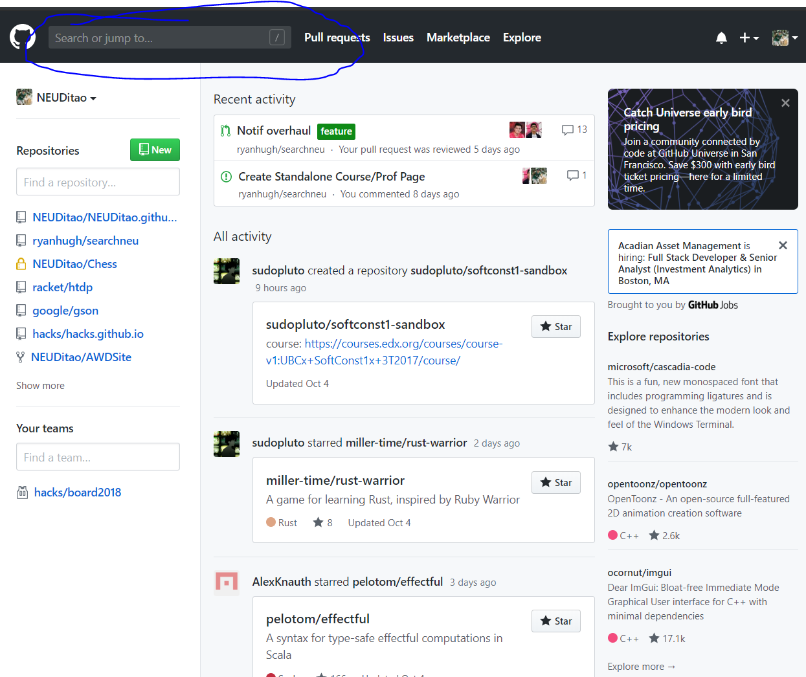
 
### Stealing Other People's Work
Click Search or jump to. We’re going to be setting up a theme for our website called [mmistakes/
minimal-mistakes](https://github.com/mmistakes/minimal-mistakes), so search for that in the search bar. 
You should see something like this pop up:

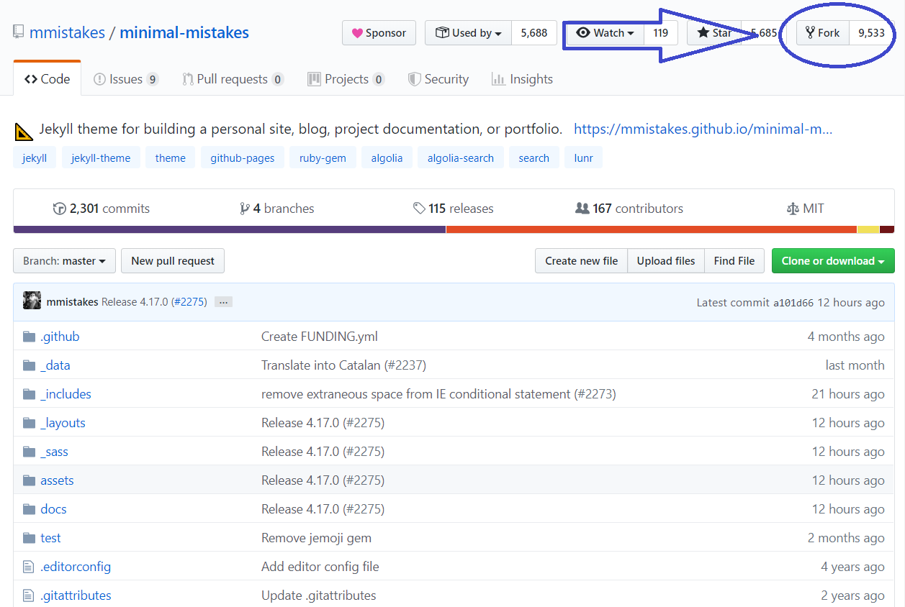
 

If you want to see an example of this theme, navigate around this page! It also uses the theme. Now, 
there’s a button near the top right that says “Fork.” Click on that button, and click on your profile 
picture. Now, it should navigate you to something that looks like the same thing, but with one difference, 
it should now say `<your-username>minimal-mistakes`. Now go to “Settings,” 

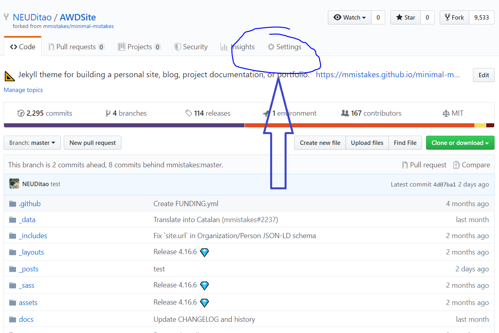
 
### Turning it into your own
You should see an option called “Respository name.” Rename it to `<your-username>.github.io`. This tells Github “I want this to be where the code my website lives.”

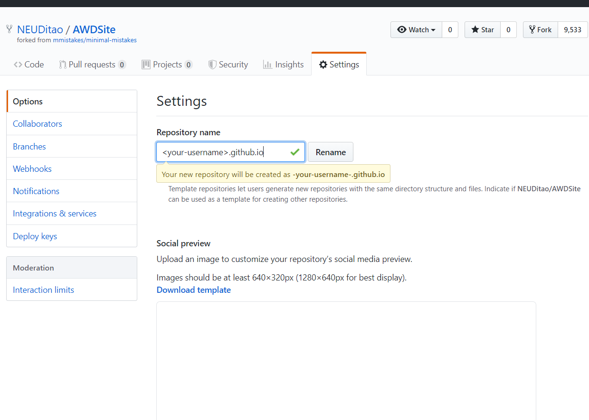
 
And now we’re ready to start making a personal site! In fact, you can see it online now! In a new tab, go 
to `<your-username>.github.io` (from now on, we’ll be referring to that as the home page).


## Starting Customization:

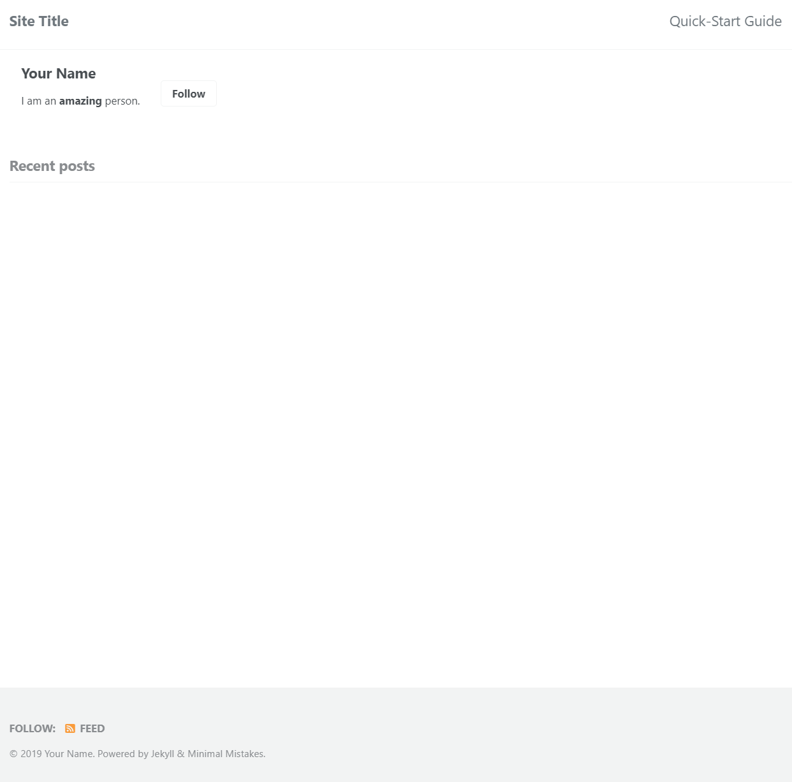
 

Hm… not much going on right now is there? That’s alright, let’s get some customization in! Go back to your 
repository, and find the file called `_config.yml`
 
 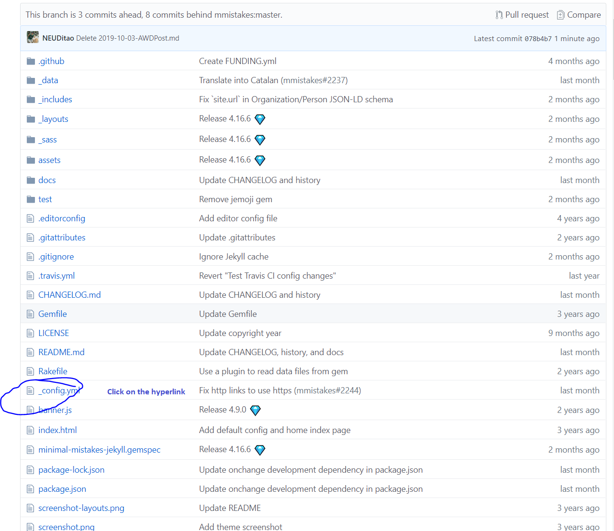

Click on the file, and click on the pencil in the next menu:
 
### Customizing the Title
Let’s make some changes, shall we? There’s a lot going on here, but basically, this is where you can put 
“global” changes to your website – changing the title of your site, or the social media links at the 
bottom of sites, etc. Let’s change a few small things to show how it works!

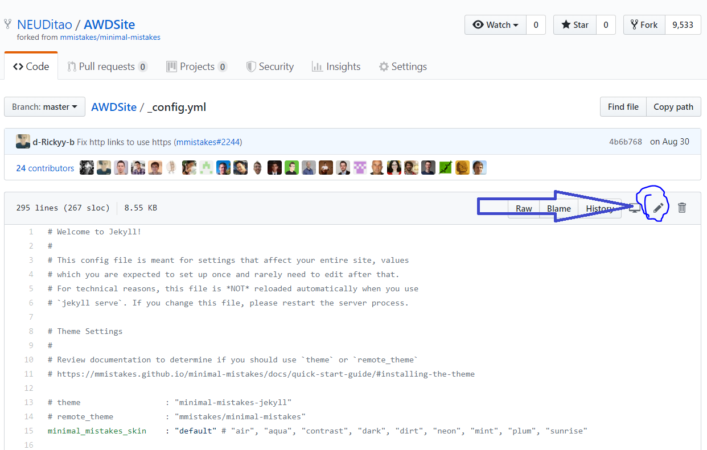

First, let’s find the line that says `title: “Site Title”`. We probably want to change that to something a 
little more personalized. Feel free to change it to whatever you want!
 
 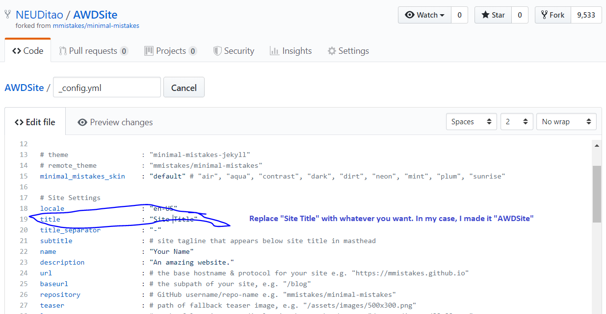

Make sure that all changes you make are between quotation marks, or else things will start getting messed 
up.

Under `#Site Settings`, I changed my name, description, and title. That’s enough for now, isn’t it? Let’s 
save these changes, and see how it’s changed our site! Scroll to the bottom of the site, and you’ll see 
this:
 


Press commit changes and, voila! The changes are now online! You might need to wait a moment, or open an 
incognito window, but when the website refreshes, you should see some of your changes reflected!

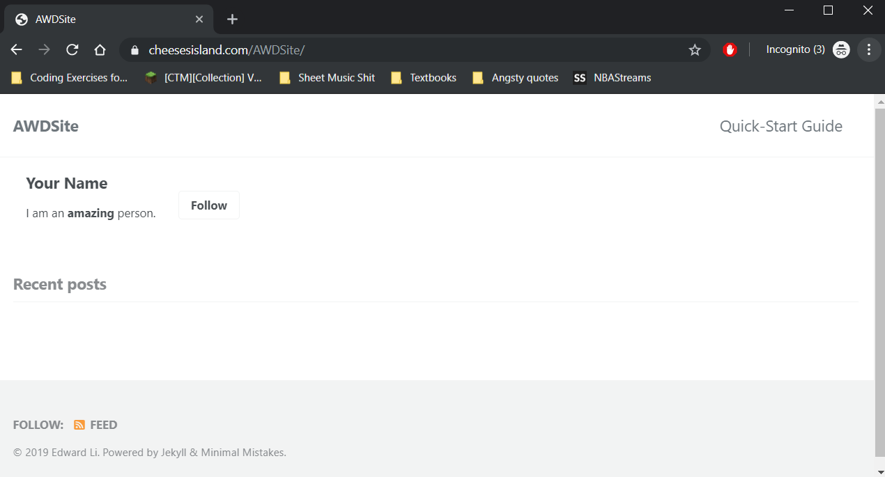 

Awesome! Now your website title has been updated. But there’s still quite a bit to be done huh. Let’s go 
back to `_config.yml` and change a few more things.

Under `# Site Author`, feel free to change these fields to something better. I’ll show you how to upload 
an image of yourself later. 
 
 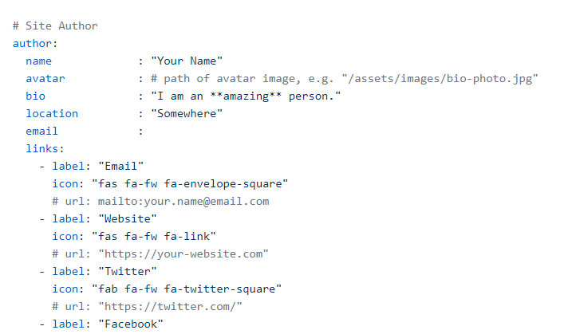

Quick note: to bold something, put two asterisks (\*) around what you’re posting. Asterisks are special 
characters in this world, and alter your text. To write down an asterisk itself, you’ll have to use `\*`.
 
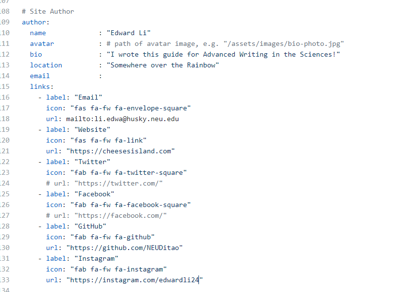

That’s quite a bit changed ! Let’s commit it for now.

 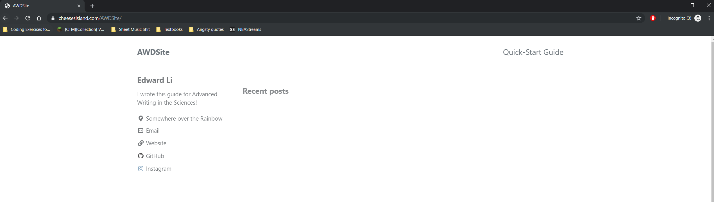

Boom that looks good!


### Adding Social Medias
But hmm, we want to add our job stuff right? Let’s add our Linkedin! Go back to _config.yml again… and scroll right to where we just edited our User stuff!

Now let’s add a few lines of code underneath where “Instagram” is. It’ll go like:
```
    - label: "LinkedIn"
	      icon: "fab fa-fw fa-linkedin"
	      url: "https://www.linkedin.com/in/<your-url-here> /"
```

So overall, the file will look like:

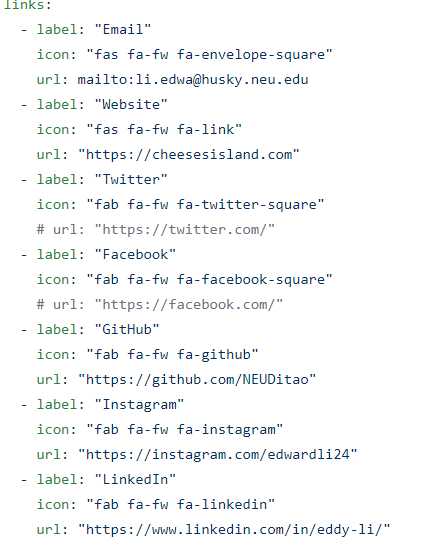
 
This will add your LinkedIn to the home bar, allowing users to see that clearly!
One last thing, let’s add a picture! You can upload anything you want. I’m going to just use my linked-in 
photo.


### Adding A Profile Image
Go to the line that says `avatar: # path of avatar image, e.g. "/assets/images/bio-photo.jpg"`, and get 
rid of the part `# path of avatar image, e.g.`. Also replace “/assets/images/bio-photo.jpg” with `assets/
bio-photo.jpg` (don’t forget to commit!) 

Now go back to the home of the repository. You do this by clicking on the `<your-username>.github.io` link 
at the very top of the page. 

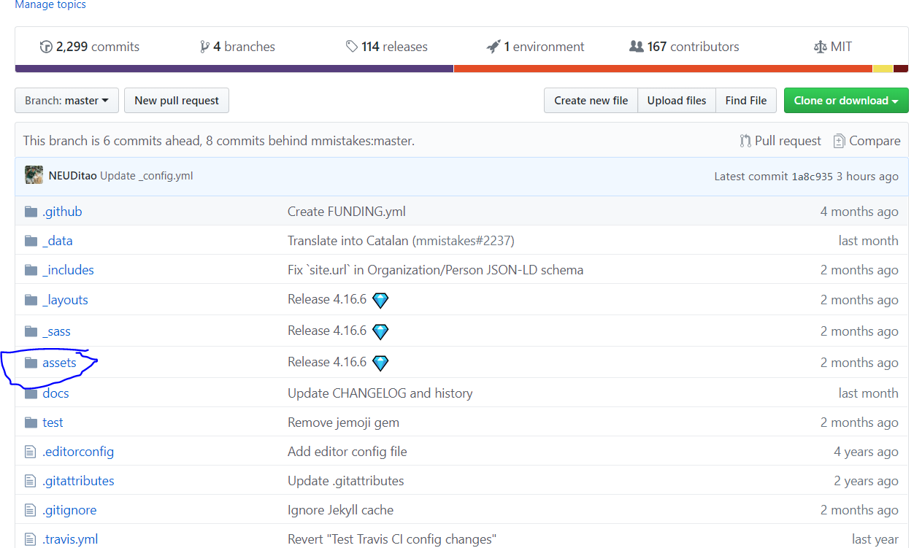`
 
Now click on assets.
You’ll want to upload a file. **Make sure the file you have is renamed `bio-photo.jpg”`!!!!** Just drag 
that photo into the repository, and hit “commit”. It’ll spit you back out to the main repository page.

Let’s go see your website now! Go to `<your-username>.github.io`
  


Doesn’t that look snazzy?

Wow that was a lot, huh? Feel free to take a break if necessary. I know I will.

## First Blog Post

Let’s walk through one last thing, making your first blog post! To do that, create a file.
 
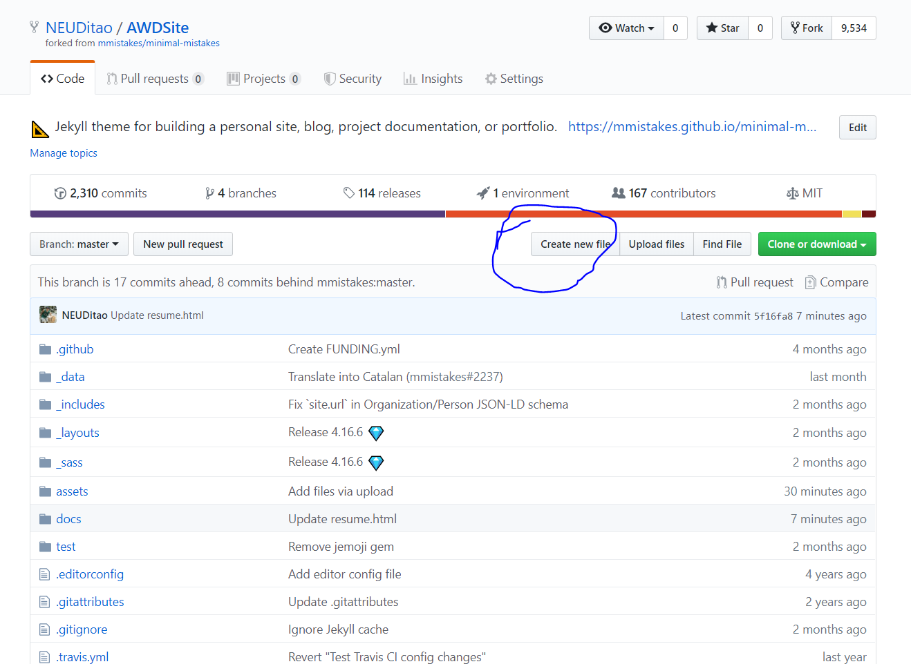

Let’s call it `_posts/<todays-date>-test.md`

Today’s date should be formatted as `<YYYY-MM-DD>`. So I’ll call mine `2019-10-05-test.md`.

 
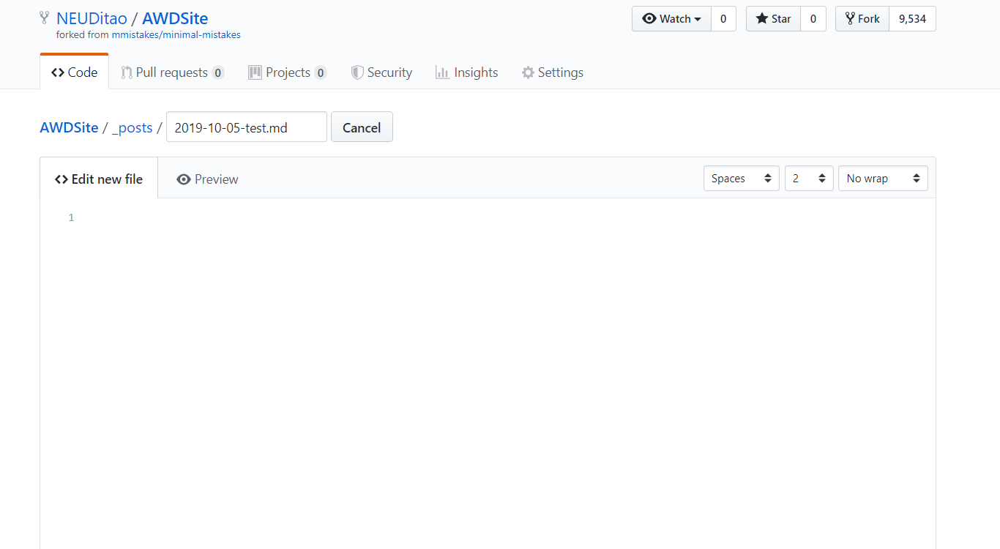

Now, let’s name it something, shall we?
Let’s add this bit of code to it.
```
---
title: My First Post
tags:
  - blog
  - post
---
```
  
And boom! Now we’re going to just add some text, and we’re going to be done!

So some quick tips while writing this blog post,

If you put a “#” in front of something, it makes a Header, like Word headers.
Putting double asterisks around a word makes it bold.
Doing [link](url) creates a hyperlink
Doing  does images!

It’s pretty cool!

Let’s see what my site looks like.
 


Check it out [here!](https://cheesesisland.com/AWDSite/test/)


## Conclusion

That’s all I got for now. To add more posts, just make more and more files! To learn more about the theme, 
check out [the quick start guide](https://mmistakes.github.io/minimal-mistakes/docs/quick-start-guide/). To learn more about 
formatting text, check out [this page on Markdown, the text language used for the blog posts](https://guides.github.com/features/mastering-markdown/).

If you ever want to get into actual coding, and make your own website, check out the tutorials [here](https://www.w3schools.com/html/). And final, if you have any questions, send them to [my e-mail](mailto:li.edwa@northeastern.edu). I’d always be happy to help!
